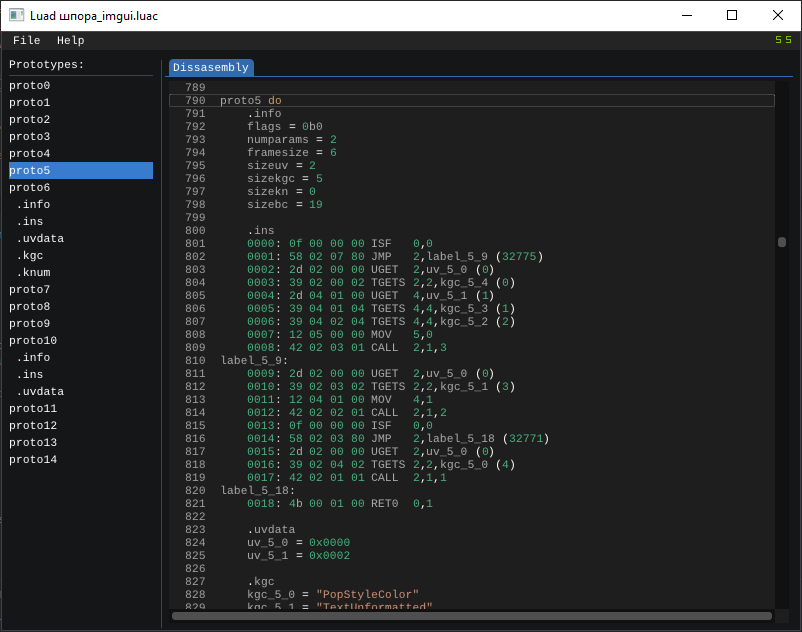

# Luad
[English](README.md) | Русский
<p align="center"></p>

[](https://isocpp.org/)
[](https://en.wikipedia.org/wiki/C%2B%2B#Standardization)
[](https://opensource.org/licenses/GPL-3.0)

Luad - Дизассемблер для скомпилированных Lua скриптов.  
На данный момент программа находиться в разработке (v0.11-pre-alpha).

Поддерживаемые компиляторы:
- [LuaJIT](http://luajit.org/) v1 & v2.

## Build
Зависимости:
- [GLFW](https://github.com/glfw/glfw);
- [gl3w](https://github.com/skaslev/gl3w);
- [Dear ImGui](https://github.com/ocornut/imgui) (git submodule);
- [ImGuiColorTextEdit](https://github.com/BalazsJako/ImGuiColorTextEdit) (git submodule);
- [{fmt}](https://github.com/fmtlib/fmt);
- [DisLua C++ (disluapp)](https://github.com/imring/disluapp).

```bash
$ git clone --recursive https://github.com/imring/luad
$ cd luad
$ mkdir build && cd build
$ cmake ..
$ cmake --build .
```
Результат сборки будет в папке `luad/output`.

## Using
Откройте терминал и используйте команду:
```bash
./luad [file]
```
Убедитесь, что там имеется папка `fonts` с шрифтами [Liberation](https://github.com/liberationfonts/liberation-fonts).

## TODO
- Графический просмотр (пр. [IDA](https://www.hex-rays.com/products/ida/tech/graphing/));
- Просмотр декомпилированного кода;
- Написание своих плагинов на Lua;
- Перезапись информации.

## License
Luad находится под лицензией [GNU General Public License v3.0](https://opensource.org/licenses/GPL-3.0).

## Copyright
[disluapp](https://github.com/imring/disluapp) находится под лицензией [MIT License](https://opensource.org/licenses/MIT).  
[{fmt}](https://github.com/fmtlib/fmt) находится под лицензией [MIT License](https://opensource.org/licenses/MIT).  
[ImGuiColorTextEdit](https://github.com/BalazsJako/ImGuiColorTextEdit) находится под лицензией [MIT License](https://opensource.org/licenses/MIT).  
[Dear ImGui](https://github.com/ocornut/imgui) находится под лицензией [MIT License](https://opensource.org/licenses/MIT).  
[GLFW](https://github.com/glfw/glfw) находится под лицензией [zlib/libpng license](https://opensource.org/licenses/Zlib).  
[gl3w](https://github.com/skaslev/gl3w) находится в общественном достоянии.  
[OpenGL](https://www.opengl.org/) является зарегистрированным товарным знаком [Hewlett Packard Enterprise](https://www.hpe.com/).