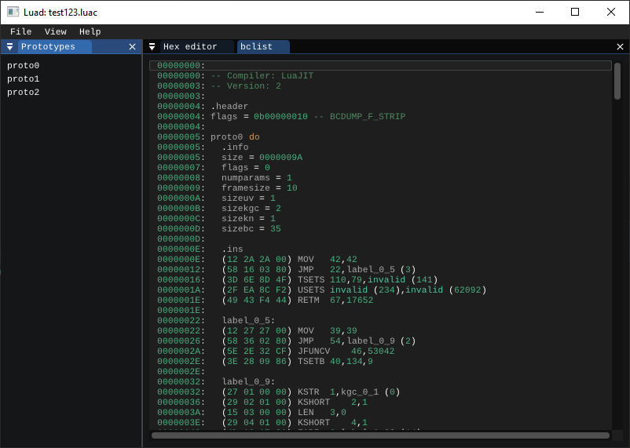
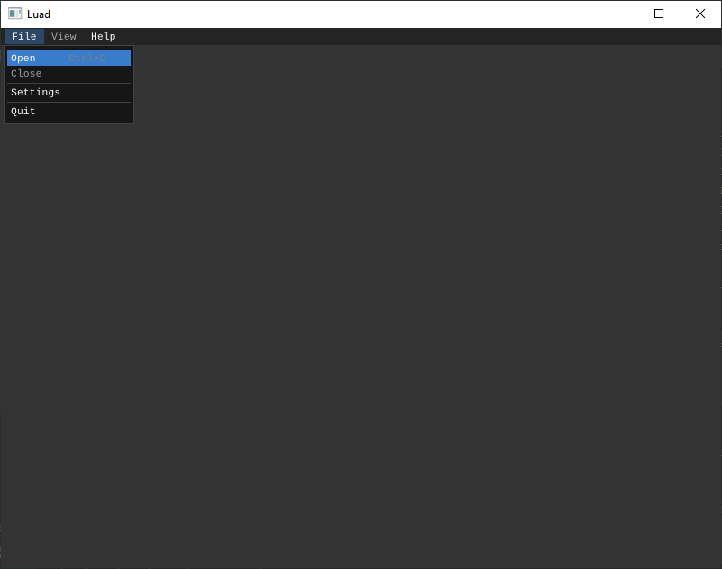
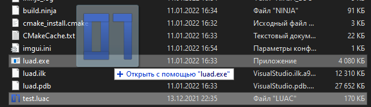

# Luad
[English](README.md) | Русский

Luad - Дизассемблер для скомпилированных Lua скриптов.  
На данный момент программа находится в разработке (v0.20-pre-alpha).

## Скриншот


## Функционал
- Hex редактор
- Дизассемблер
  - Перейти к строке по адресу/прототипу или его элементов.  

Поддерживаемые компиляторы:
- [LuaJIT](https://luajit.org/) v1 & v2;

Следить за реализацией будущего функционала можете [здесь](https://github.com/users/imring/projects/1/views/1).

## Сборка
Для сборки потребуется:
- Компилятор с поддержкой C++20;
- [CMake](https://cmake.org/);

Так же потребуются зависимости:
- [disluapp](https://github.com/imring/disluapp);
- [{fmt}](https://github.com/fmtlib/fmt);
- [nlohmann_json](https://github.com/nlohmann/json);
- [nativefiledialog-extended](https://github.com/btzy/nativefiledialog-extended)*;
- [glfwpp](https://github.com/janekb04/glfwpp)*;
- [imgui_club](https://github.com/ocornut/imgui_club)*;
- [ImGuiColorTextEdit](https://github.com/BalazsJako/ImGuiColorTextEdit)*;

\* - имеется в репозитории как подмодуль.

```shell
git clone --recurse-submodules https://github.com/imring/luad
cd luad
cmake . -B build
cmake --build build
```
Результат сборки будет находиться в папке `luad/build`.

## Использование
Вы можете открыть файл с помощью строки меню `File->Open` в программе:  
  
Либо с помощью "Открыть с помощью..." в проводнике:  


## Авторы
- [imring](https://github.com/imring);

## Лицензия
Программа распространяется под лицензией [GNU General Public License v3.0](LICENSE).  
- Библиотека disluapp распространяется под лицензией [MIT License](https://github.com/imring/disluapp/blob/master/LICENSE).
- Библиотека {fmt} распространяется под лицензией MIT License.
- Библиотека nlohmann_json распространяется под лицензией [MIT License](https://github.com/nlohmann/json/blob/develop/LICENSE.MIT).
- Библиотека nativefiledialog-extended распространяется под лицензией [zlib License](https://github.com/btzy/nativefiledialog-extended/blob/master/LICENSE).
- Библиотека glfwpp распространяется под лицензией [MIT License](https://github.com/janekb04/glfwpp/blob/main/LICENSE).
- Библиотека imgui_club распространяется под лицензией [MIT License](https://github.com/ocornut/imgui_club/blob/master/LICENSE.txt).
- Библиотека ImGuiColorTextEdit распространяется под лицензией [MIT License](https://github.com/BalazsJako/ImGuiColorTextEdit/blob/master/LICENSE).