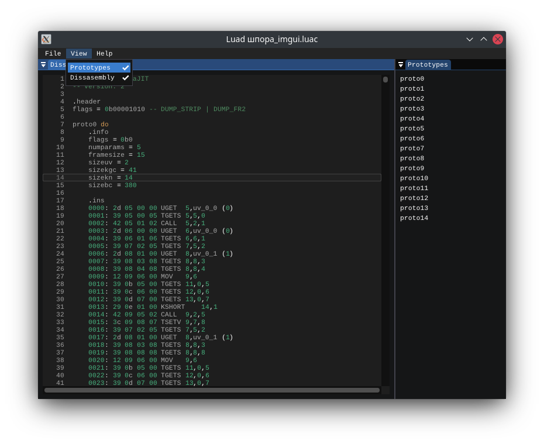

# Luad
English | [Русский](README-RU.md)
<p align="center"></p>

[](https://isocpp.org/)
[](https://en.wikipedia.org/wiki/C%2B%2B#Standardization)
[](https://opensource.org/licenses/GPL-3.0)

Luad - Disassembler for compiled Lua scripts.  
At the moment the program is in development (v0.12-pre-alpha).

Supported compilers:
- [LuaJIT](http://luajit.org/) v1 & v2.

## Build
Dependencies:
- [GLFW](https://github.com/glfw/glfw);
- [gl3w](https://github.com/skaslev/gl3w);
- [Dear ImGui](https://github.com/ocornut/imgui) (git submodule);
- [ImGuiColorTextEdit](https://github.com/BalazsJako/ImGuiColorTextEdit) (git submodule);
- [{fmt}](https://github.com/fmtlib/fmt);
- [DisLua C++ (disluapp)](https://github.com/imring/disluapp) >= v1.03.

```bash
$ git clone --recursive https://github.com/imring/luad
$ cd luad
$ mkdir build && cd build
$ cmake ..
$ cmake --build .
```
The build result will be in the directory `luad/output`.

## Using
Open the terminal and use the command:
```bash
./luad [file]
```
Make sure there is a `fonts` folder with fonts of [Liberation Mono](https://github.com/liberationfonts/liberation-fonts).

## TODO
- Graph view (e.g. [IDA](https://www.hex-rays.com/products/ida/tech/graphing/));
- View decompiled code;
- Writing your own Lua plugins;
- Rewrite the information.

## License
Luad is licensed under the [GNU General Public License v3.0](https://opensource.org/licenses/GPL-3.0).

## Copyright
[disluapp](https://github.com/imring/disluapp) is licensed under the [MIT License](https://opensource.org/licenses/MIT).  
[{fmt}](https://github.com/fmtlib/fmt) is licensed under the [MIT License](https://opensource.org/licenses/MIT).  
[ImGuiColorTextEdit](https://github.com/BalazsJako/ImGuiColorTextEdit) is licensed under the [MIT License](https://opensource.org/licenses/MIT).  
[Dear ImGui](https://github.com/ocornut/imgui) is licensed under the [MIT License](https://opensource.org/licenses/MIT).  
[GLFW](https://github.com/glfw/glfw) is licensed under the [zlib/libpng license](https://opensource.org/licenses/Zlib).  
[gl3w](https://github.com/skaslev/gl3w) is in the public domain.  
[OpenGL](https://www.opengl.org/) is a registered trademark of [Hewlett Packard Enterprise](https://www.hpe.com/).