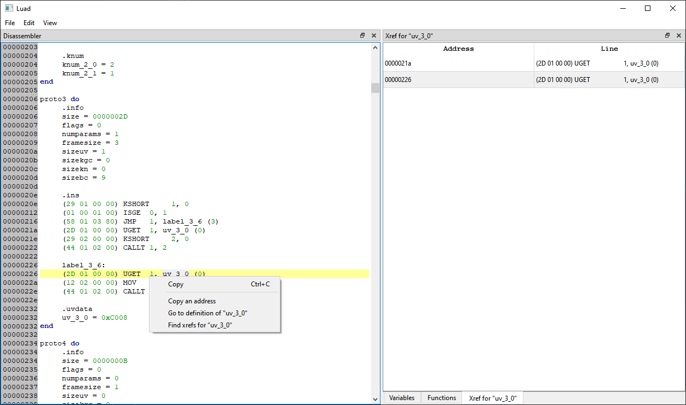

# Luad

Luad - Disassembler for compiled Lua scripts. At the moment the program is in development (v0.22-pre-alpha).

# Screenshot


# Features

- [ ] Disassembly
    - [x] View pseudo-code;
    - [ ] Modify byte-code;
    - [x] Navigation with jumps/windows with functions or variables;
    - [x] Xrefs (external references);
    - [x] Custom line highlight.
- [x] Hex-editor
    - [x] Link to Disassembly.
- [ ] Plugins

# Supported compilers
- [LuaJIT](https://luajit.org/) (v2.0 & v2.1);

## Build
To build it you'll need:
- Compiler with C++20 support;
- [CMake](https://cmake.org/);

You'll also need dependencies:
- [Qt 6](https://www.qt.io/) (tested on 6.2.4);
- [disluapp](https://github.com/imring/disluapp)*;
- [{fmt}](https://github.com/fmtlib/fmt)*;
- [qhexedit2](https://github.com/Simsys/qhexedit2)**;

\* - is included in the project with [`FetchContent`](https://cmake.org/cmake/help/latest/module/FetchContent.html).  
\*\* - is included in the project with [`submodules`](https://git-scm.com/book/en/v2/Git-Tools-Submodules).

```shell
git clone https://github.com/imring/Luad --recurse-submodules
cd Luad
cmake . -B build
cmake --build build
```

## License
The program is licensed under the [GNU General Public License v3.0](LICENSE).
- disluapp is licensed under the [MIT License](https://github.com/imring/disluapp/blob/master/LICENSE).
- {fmt} is licensed under the MIT License.
- Qt is licensed under the [GNU Lesser General Public License (LGPL) v3.0](https://doc.qt.io/qt-6/lgpl.html).
- qhexedit2 is licensed under the GNU Lesser General Public License (LGPL) v2.1.