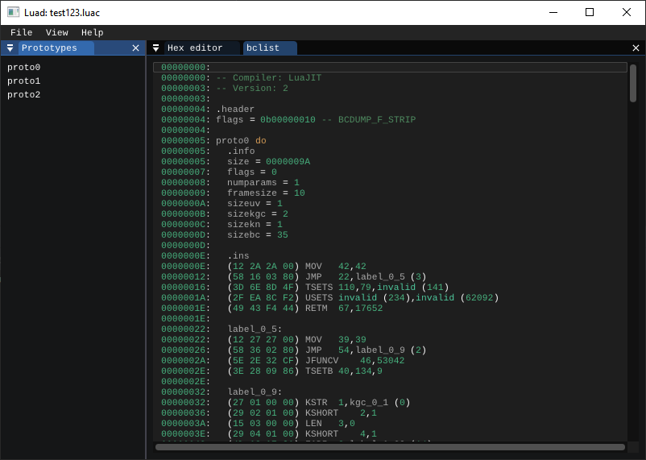
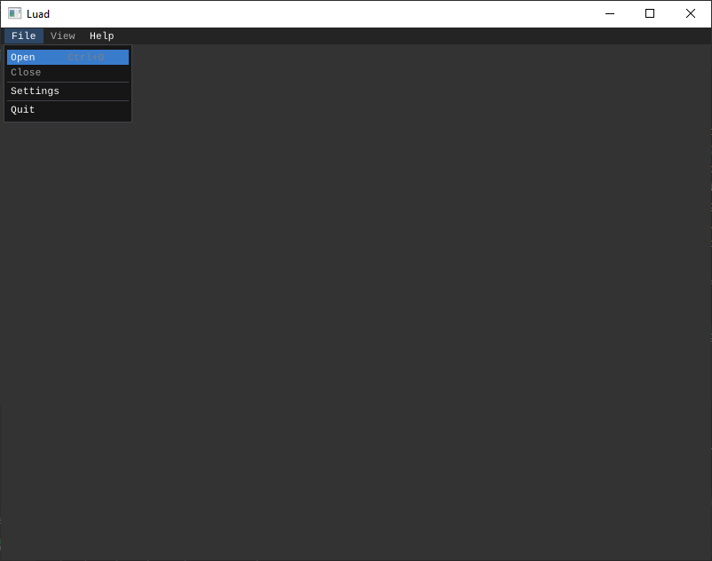
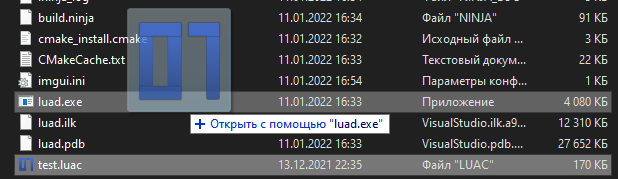

# Luad
English | [Русский](README-RU.md)

Luad - Disassembler for compiled Lua scripts.  
At the moment the program is in development (v0.20-pre-alpha).

## Screenshot


## Functional
- Hex editor
- Diassembler
    - Jump to a string by address/prototype or its elements.

Supported compilers:
- [LuaJIT](https://luajit.org/) v1 & v2;

Follow the implementation of future functionality [here](https://github.com/users/imring/projects/1/views/1).

## Build
To build it you'll need:
- Compiler with C++20 support;
- [CMake](https://cmake.org/);

You'll also need dependencies:
- [disluapp](https://github.com/imring/disluapp);
- [{fmt}](https://github.com/fmtlib/fmt);
- [nlohmann_json](https://github.com/nlohmann/json);
- [nativefiledialog-extended](https://github.com/btzy/nativefiledialog-extended)*;
- [glfwpp](https://github.com/janekb04/glfwpp)*;
- [imgui_club](https://github.com/ocornut/imgui_club)*;
- [ImGuiColorTextEdit](https://github.com/BalazsJako/ImGuiColorTextEdit)*;

\* - is included in the repository as a submodule.

```shell
git clone --recurse-submodules https://github.com/imring/luad
cd luad
cmake . -B build
cmake --build build
```
The build result will be in the directory `luad/build`.

## Using
You can open a file with the menu line `File->Open` in the program:
  
Or with "Open with..." in the explorer:


## Authors
- [imring](https://github.com/imring);

## License
The program is licensed under the [GNU General Public License v3.0](LICENSE).
- The disluapp library is licensed under the [MIT License](https://github.com/imring/disluapp/blob/master/LICENSE).
- The {fmt} library is licensed under the MIT License.
- The nlohmann_json library is licensed under the [MIT License](https://github.com/nlohmann/json/blob/develop/LICENSE.MIT).
- The nativefiledialog-extended library is licensed under the [zlib License](https://github.com/btzy/nativefiledialog-extended/blob/master/LICENSE).
- The glfwpp library is licensed under the [MIT License](https://github.com/janekb04/glfwpp/blob/main/LICENSE).
- The imgui_club library is licensed under the [MIT License](https://github.com/ocornut/imgui_club/blob/master/LICENSE.txt).
- The ImGuiColorTextEdit library is licensed under the [MIT License](https://github.com/BalazsJako/ImGuiColorTextEdit/blob/master/LICENSE).